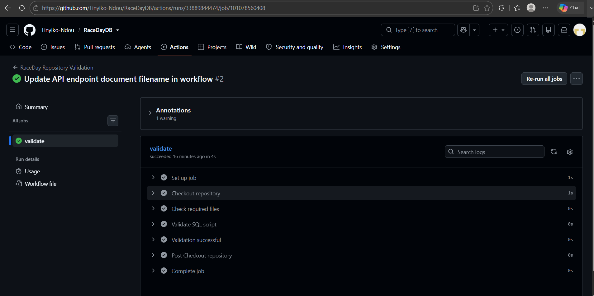

RaceDay event management system

- System Description

RaceDay is a web-based event management system designed to manage
running, walking and cycling events in South Africa.

The system allows organisers to create and manage events, categories,
routes and event information. Participants can browse events, enrol
in events and view their results.

- User Roles
- 
-Participant
Participants can:
- Register and log in
- View available events
- View event categories
- Enrol in events
- View their enrolments
- View their results
- 
- Organiser
Organisers can:
- Register and log in
- Create events
- Update events
- Manage event categories
- Manage routes
- Record participant results
- Manage event information

- Database

The RaceDay database is implemented using Microsoft SQL Server.

The database script can be found in:

`/docs/RaceDayDB.sql`

-ERD

The Entity Relationship Diagram can be found in:

`/docs/RaceDay_ERD.pdf`

- API Endpoint Plan

The API Endpoint Plan can be found in:

`/docs/RaceDay_API_Endpoint_Plan.docx`

## CI/CD Pipeline

